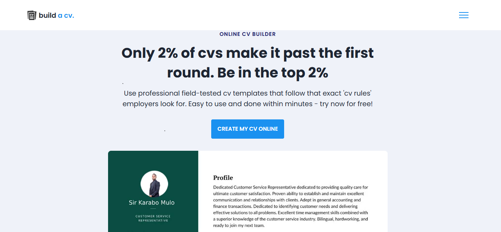
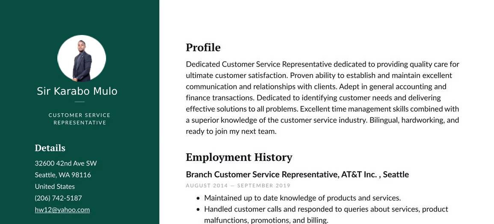

# Responsive Online Curriculumn Vitae Builer

### Make your network your networth with this curriculum-vitae builder

- Responsive Personal Website CV builder Design Using HTML CSS And JavaScript
- Compatible with all mobile devices and with a beautiful and pleasant user interface.
- You may download and change images and font for your own personalized feel. 
💙 Connect with me on Linkedin if you'd like me to do work for you like this - 
[@SirNhlamulo](https://www.linkedin.com/in/sir-nhlamulo/)

Tech Stack:
- [Responsive Html Code](https://www.w3schools.com/html/)
- [CDNJS - remix 4.2.0](https://cdnjs.com/libraries/remixicon/4.2.0)
- [Validation](https://developer.mozilla.org/en-US/docs/Web/JavaScript/Guide/Regular_expressions)
- [Photopea](https://www.photopea.com/)

### Create your CV with a Resume builder

### Print Your CV

